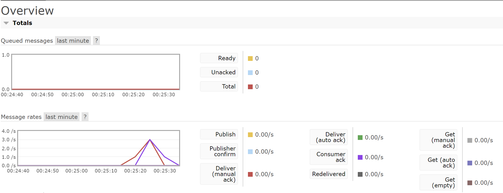

a. what is amqp?

Amqp memiliki kepanjangan Advanced Message Queuing Protocol. Dimana aplikasi client dibuat untuk bisa berkomunikasi dengan aplikasi server yang mengirimkan data berbasis middleware. Middleware ini akan berguna sebagai interface data yang dibutuhkan oleh client.

b. what it means? guest:guest@localhost:5672 , what is the first quest, and what is
the second guest, and what is localhost:5672 is for? 

- `guest` pertama adalah username untuk autentikasi.
- `guest` kedua adalah sebagai kata sandi untuk autentikasi.
- `localhost` adalah hostname atau alamat IP dari mesin dimana komunikasi akan berjalan. 
- `5672` adalah nomor port letak komunikasi akan terjadi.

Banyaknya total antrian yang terjadi kurang lebih 15. Hal ini dikarenakan `cargo run` dirun 4 kali yang seharusnya dijalankan dalam 20 detik (5 pesan per run x 4 kali run). Namun, karena saya melakukan `cargo run` secara sequential, maka terdapat delay dan hanya tercapture antrian maksimal sebesar 15 dalam satu waktu.

Dilakukan 5 `cargo run` pada publisher, namun, kali ini tidak terjadi antrian berbeda pada sebelumnya yang melakukan run 4 kali terjadi 15 antrian. Hal ini dikarenakan subscriber melakukan multithreading dalam menghandle event komunikasi yang dikirim publisher, memungkinkan melakukan proses secara paralel.

Beberapa improvement pada kode yang dapat dilakukan adalah.
1. Melakukan paralelisme pada publisher untuk mengirim banyak request sekaligus untuk mendapatkan simulasi akan high traffic yang lebih akurat.
